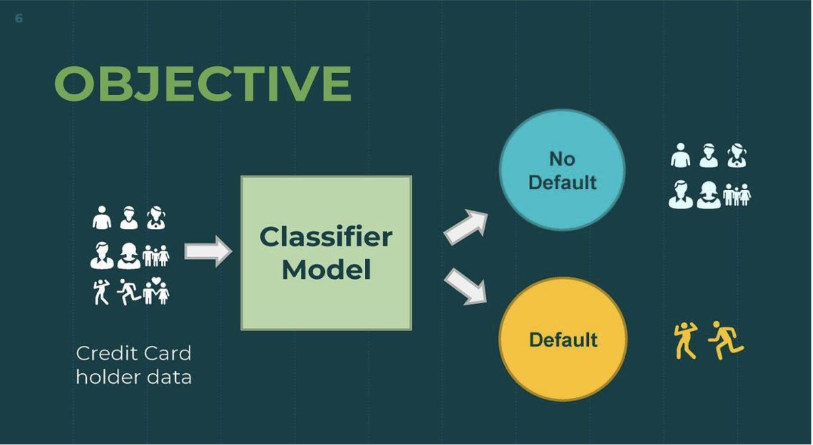

# CreditWatch: Predicting Credit Default

## Overview

CreditWatch is a machine learning project aimed at predicting credit card payment defaults using demographic and financial data. The project leverages advanced data processing techniques and a variety of machine learning algorithms to develop a robust prediction model. By analyzing a dataset of 30,000 credit card clients, the project aims to provide insights that can help financial institutions mitigate credit risks and make informed decisions.

## Key Features

- Dataset: Credit card client data from Taiwan (April–September 2005) containing 30,000 records with 23 features and a binary target variable.
- Machine Learning Models: Includes Logistic Regression, Gaussian Naive Bayes, Random Forest, XGBoost, Support Vector Machine, and Multilayer Perceptron.
- Best Model: The Random Forest model achieved the highest accuracy (93%) with a balanced performance across all metrics.
- Data Preprocessing: Involved feature engineering, scaling, and oversampling to address class imbalance.
- Evaluation Metrics: Accuracy, Precision, Recall, F1-score, and ROC curves used for performance evaluation.
- Feature Engineering: Added a custom feature "Dues" to capture financial behavior better.
